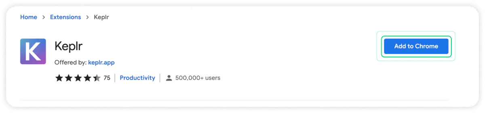
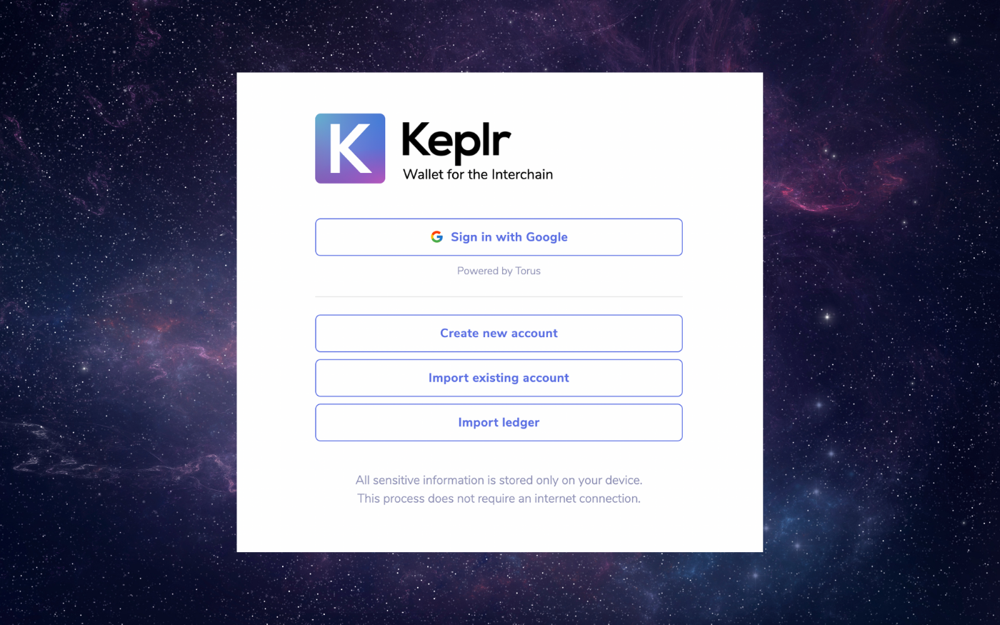
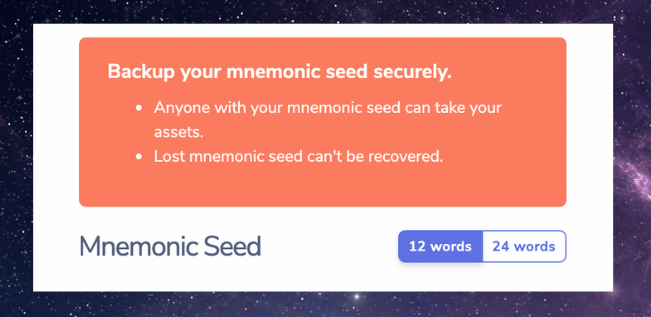
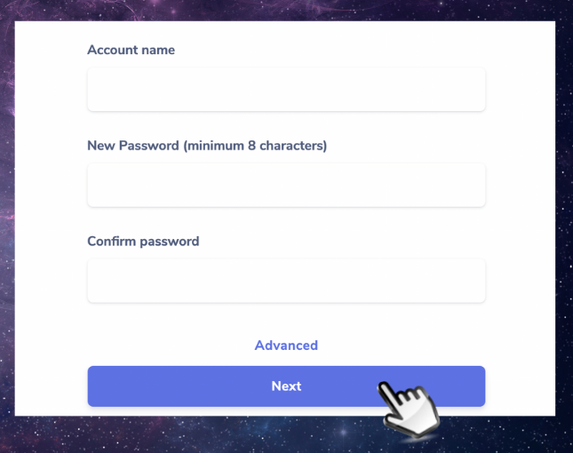
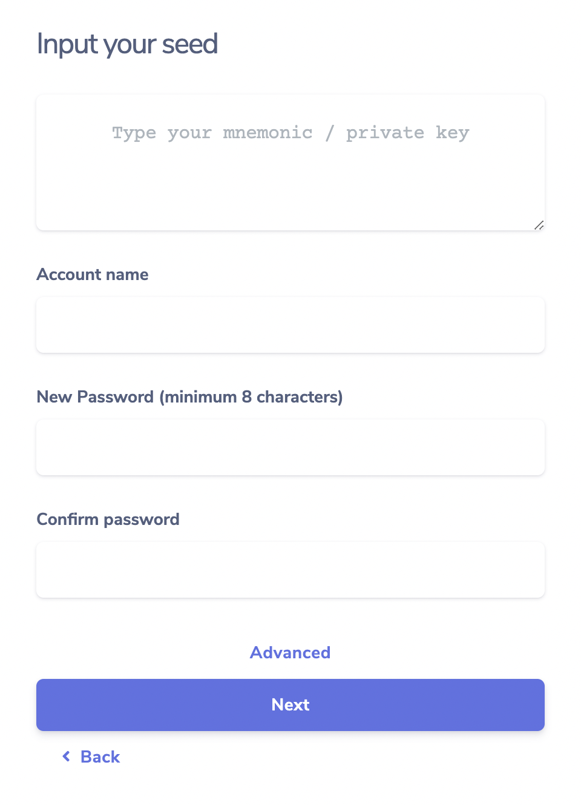
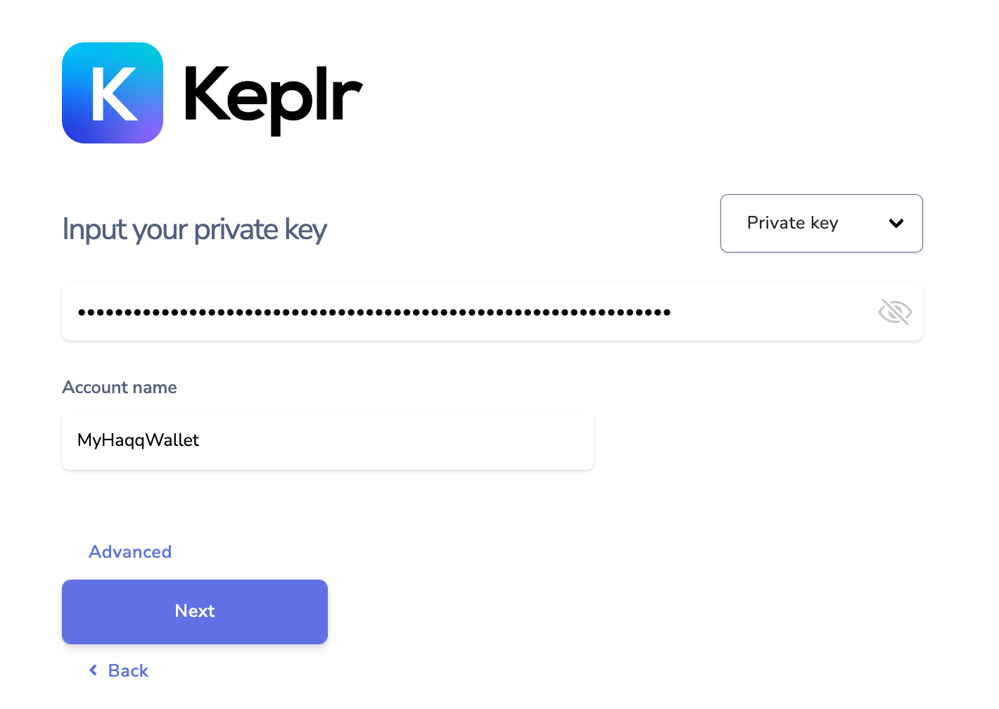
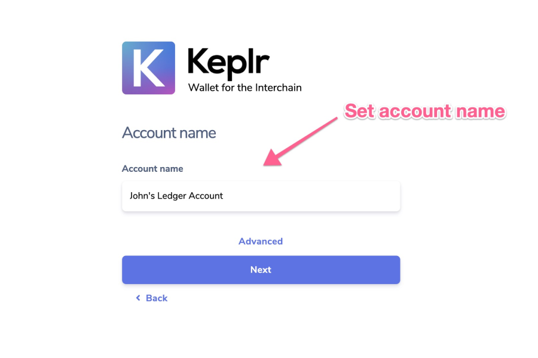
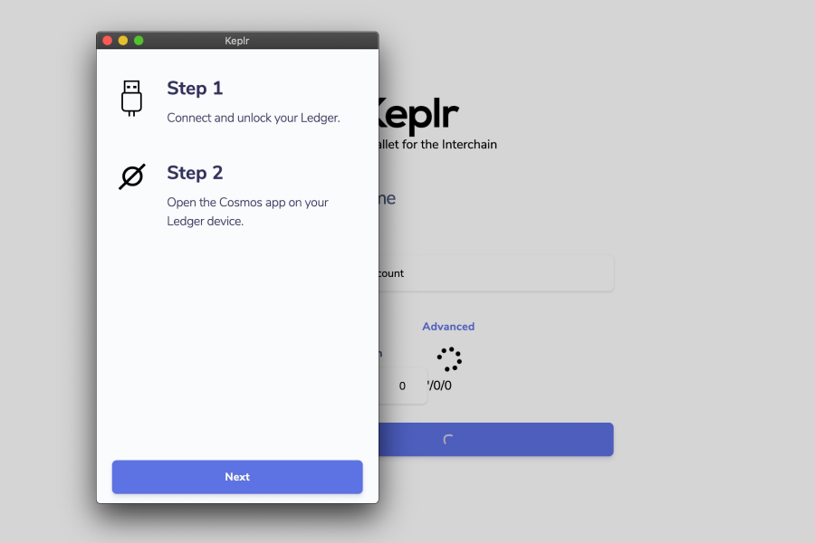

<!--
order: 4
-->

# Keplr

Connect your Keplr wallet with Haqq {synopsis}

## Pre-requisite Readings

The Keplr extension is officially supported only on Chromium-based explorers.

You can install and launch Chrome Web Browser and Keplr

Install Chrome Web Browser [here](https://www.google.com/chrome/)

::: tip

If you already have Keplr we recommend to visit our website [page](https://islamiccoin.net/keplr-instruction)

:::

## Install Keplr

The Keplr browser extension is a wallet for accessing applications in the Cosmos ecosystem and managing user identities. It can be used to connect to Haqq Network through the official testnet and request Funds from the Faucet.

You can visit official Keplr website 

- [Install Keplr](https://www.keplr.app/) {prereq}

or

Via following this [link](https://chrome.google.com/webstore/detail/keplr/dmkamcknogkgcdfhhbddcghachkejeap?hl=en)

or

You can download Web3-friendly browser [Brave](https://brave.com/download/)

## Launch Keplr

Keplr is your Haqq Wallet. After installation, please launch it.

## Create/Import Account

Open the Keplr extension on your browser. If you are setting up Keplr for the first time, you can either create a new account or import an existing account. Refer to the [Keplr documentation](https://keplr.crunch.help/getting-started) for further information.

Once you’ve installed Keplr wallet, you’ll see four options to set up an account:

1) Creating a new account via Google One-Click Login,
2) Creating a new account via setting up new seed/mnemonic phrase.
3) Importing an existing seed phrase account, or
4) Importing an existing private key
5) Connecting/importing your Ledger account. 

## Option 1: Create a New Account via Google One-Click Login

1) Choose the option [Sign in with Google]

2) Now enter an account name (which you can change later) and input a new password. Click [Next].

3) Next, you'll be prompted to sign into your Google account with your email or phone (and later password). Click [Next]. 

4) And that's it. You now have a Keplr account linked with your Google login. Don't forget to record your password in a safe place so you can log back in. (The Keplr team does not store passwords).

## Option 2: Create a New Account via Secret Seed/mnemonic Phrase

::: tip

NOTE: A seed phrase or mnemonic phrase is a string of 12 or 24 words combined to form your master account key. Only you will be given the key, and whoever holds the key will have permanent access to the wallet. Keep your seed phrase safe!

:::

1) To create a seed phrase account, choose option [Create new account].

2) The next page shows you your secret seed/mnemonic phrase. You can select a 12 or 24 words phrase. Save this phrase in a secure place but also do not lose it. (You'll need to input this phrase into the following page.) 

3) Next, enter a name for your account and password (you can change these later). Click on [Next].

4) To confirm the creation of this new account, you'll need to click on the words in the right order in which they appear in your seed/mnemonic phrase. Press [Register] and you're all set. 

## Option 3: Import an Existing Account via Mnemonic Phrase

1) Click on [Import existing account]

2) Enter your mnemonic/seed phrase in the appropriate slot, separating the words by space & taking care to check that they are spelled correctly. Account name and a new password also need to be entered. 

::: tip

Make sure you have imported the account with the correct derivation path, viewable by clicking on [Advanced]. Normally, the derivation path should be m/44'/…’/0/0/0, but if you see that when importing the account via mnemonic on Keplr the cosmos mainnet address displayed is different from yours, it is possible that the derivation path ends with 1 (or another number) instead of 0. If this is the case, all you have to do is replace the last 0 with 1. If you are interested in knowing more about the HD wallet derivation path, you type "HD derivation path" in the search bar.

:::

3) Select [Next] and the reinstallation is complete.

## Option 4: Import an existing account via Private Key

1) Click on [Import existing account]

2) Enter your private key. Account name also need to be entered.

3) Click on [Next] button

4) Congratulations, you have successfully imported your account.

## Option 5: Import/connect a Ledger Account

1) To begin importing your Ledger account, choose [Import Ledger].

2) Set the account name for the Ledger account, then click [Next].

3) Connect and unlock your Ledger hardware wallet, then open the Cosmos app. When you see ‘Cosmos ready’ on the screen, press ‘Next’ on the popup. Your browser may ask you to grant permission to access the hardware, so please make sure you approve.

4) And that’s it. You can now start using your Ledger hardware wallet with any of the blockchains that Keplr supports.

## What's next?

Add Haqq Network to your wallet

Following instructions "Add Haqq Network to your wallet" in our [website](https://islamiccoin.net/keplr-instruction) 

## Connect to Haqq TestEdge and Request Funds from the Faucet

🚧 `In developing...` 🏗

<!-- View your account balance either by clicking on the Keplr extension or by [interacting with the node](../../quickstart/interact_node.md). Note that Faucet might not display the amount of ISLM transferred by the Faucet, as it might be smaller than the number of decimals displayed in the Keplr extension. -->

## Troubleshooting & known issues

If you have previously set up Haqq Network **and** your ISLM account balance is not displayed correctly, you can fix it by following these steps:

## Step 1:

Open your Keplr wallet in your desktop browser.

Then click on the Network section. Scroll down and find “Evmos” then click on the “Evmos” section.

After that click on the Network section and scroll down and find “Haqq Network”.

Then click on the “close” circle near the “Haqq Network”.

And confirm network removal by clicking on the “Yes” button.

## Step 2:

Follow this [link](https://islamiccoin.net/keplr-instruction) to open our website page in desktop browser.

## Step 3:

Open your Keplr wallet in your desktop browser again.

Click on the Network section and scroll down to “Haqq Network”.

And click on the network name “Haqq Network”.

Make sure that the network name is “Haqq Network” and your account address has changed.

