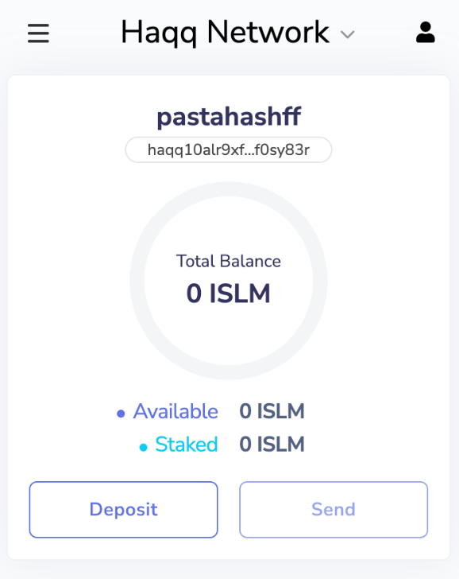
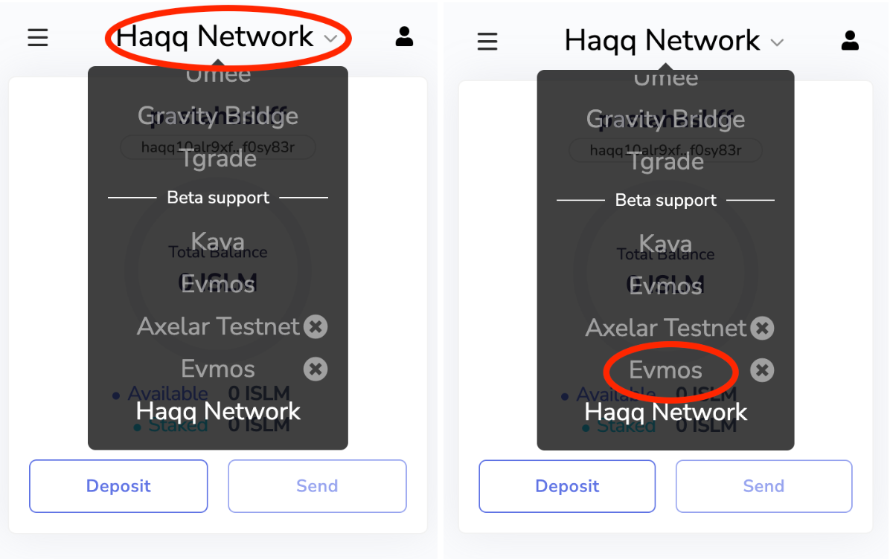
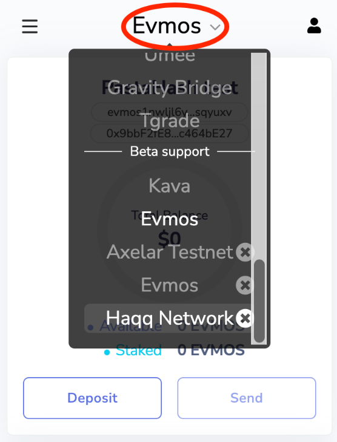
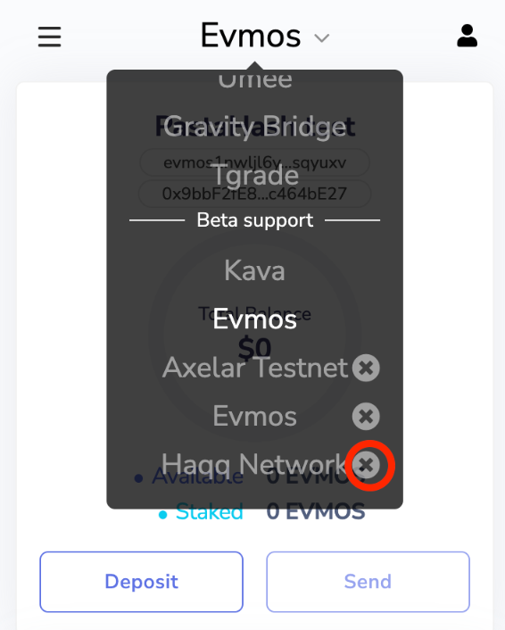
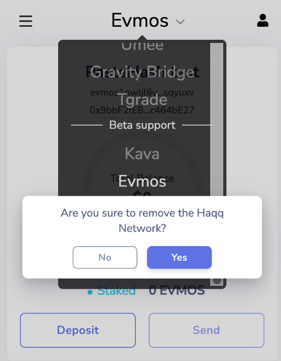
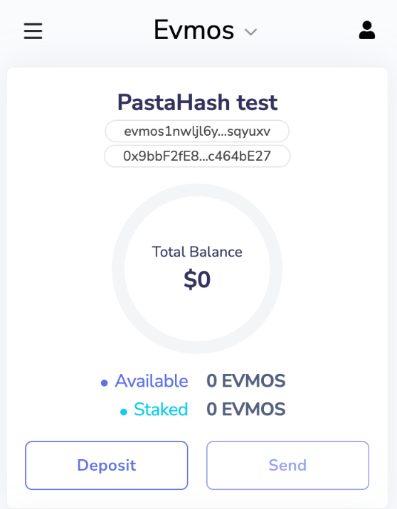
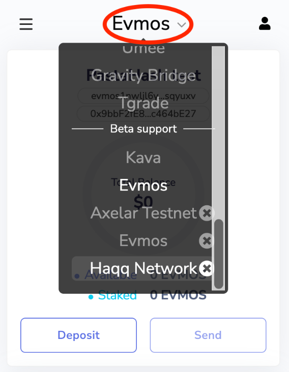
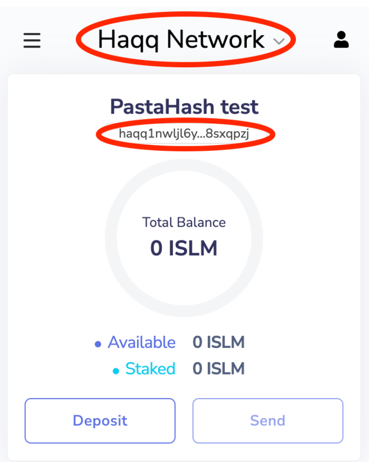

## Troubleshooting & known issues

If you have previously set up Haqq Network **and** your ISLM account balance is not displayed correctly, you can fix it by following these steps:

## Step 1:

Open your Keplr wallet in your desktop browser.

</img>

Then click on the Network section. Scroll down and find “Evmos” then click on the “Evmos” section.

</img>

After that click on the Network section and scroll down and find “Haqq Network”.

</img>

Then click on the “close” circle near the “Haqq Network”.

</img>

And confirm network removal by clicking on the “Yes” button.

</img>

## Step 2:

Follow this [link](https://islamiccoin.net/keplr-instruction) to open our website page in desktop browser.

## Step 3:

Open your Keplr wallet in your desktop browser again.

</img>

Click on the Network section and scroll down to “Haqq Network”.

</img>

And click on the network name “Haqq Network”.

</img>

Make sure that the network name is “Haqq Network” and your account address has changed.

</img>
