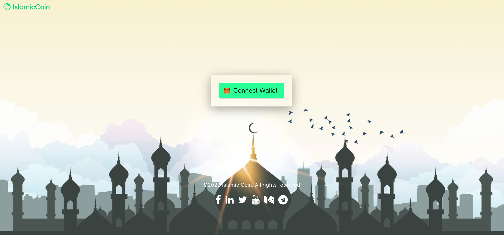
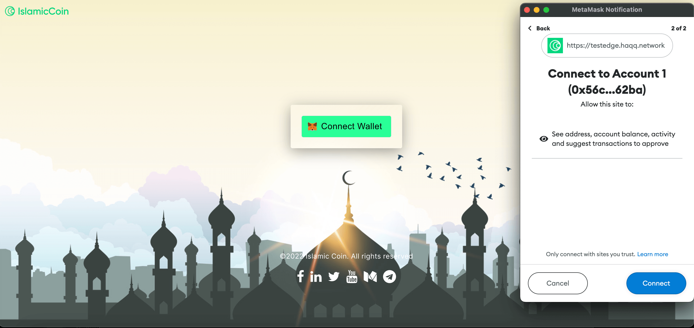
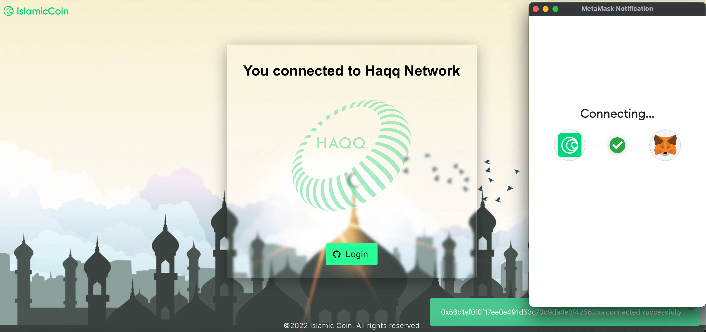
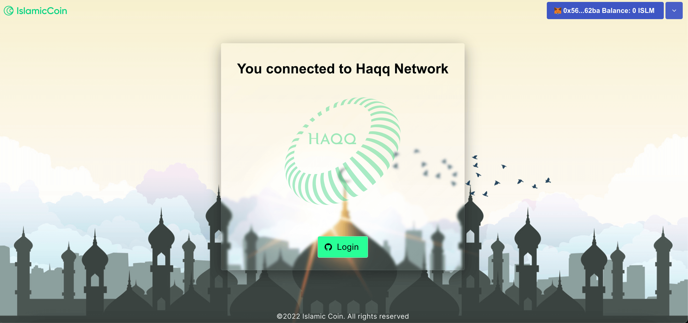
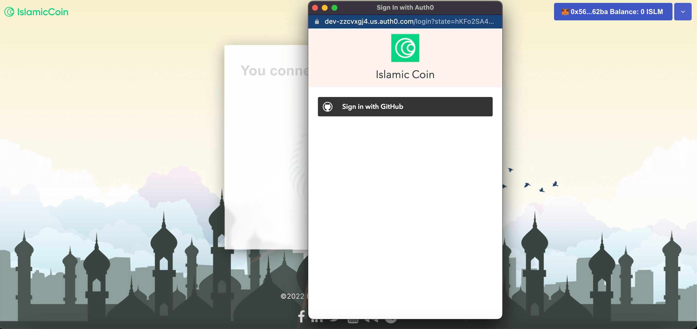
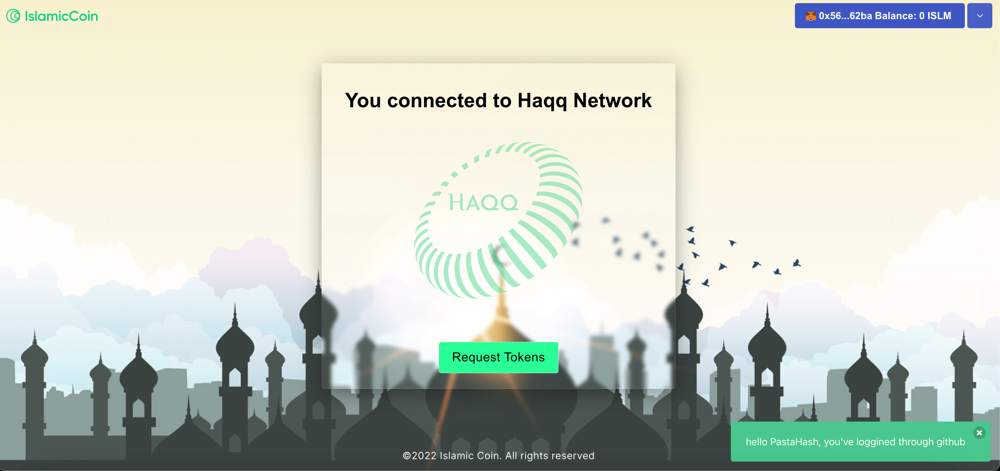

<!--
order: 2
-->

# Faucet-TestEdge

Check how to obtain testnet tokens from the Haqq faucet website {synopsis}

The Haqq TestEdge Faucet distributes small amounts of ISLM to anyone who can provide a valid testnet address for free.

::: tip
Follow the [Metamask](./../../docs/guides/keys-wallets/metamask.md) guide for more info on how to setup your wallet account.
:::

## Request Testnet tokens

<!-- markdown-link-check-disable-next-line -->
Once you are signed in to the MetaMask extension, visit the [Faucet](https://testedge.haqq.network/) to request tokens for the testnet. Click the `Connect Wallet` button.



After that, you can see a topup window with your Metamask account. You can choose account for the connection with `Faucet`.Then click `Next` button and `Connect` but for establishing connection.



Please wait until connection will be establish.



After that click on `Login` button to authorizing via your GitHub account.



Click on `Sign in with Github` button to approve authorization.



Click on `Request Tokens` button to recive ISLM.



## Rate limits

To prevent the faucet account from draining the available funds, the Haqq TestEdge faucet imposes a maximum number of requests for a period of time. By default, the faucet service accepts 1 request per day per address. You can request ISLM from the faucet for each address only once every 24h. If you try to request multiple times within the 24h cooldown phase, no transaction will be initiated. Please try again in 24 hours.

## Amount

For each request, the faucet transfers 1 ISLM to the given address.

<!-- # Faucet-localnet

The faucet is a web application with the goal of distributing small amounts of Ether in private and test networks.

## Features

* Allow to configure the funding account via private key or keystore
* Asynchronous processing Txs to achieve parallel execution of user requests
* Rate limiting by ETH address and IP address as a precaution against spam
* Prevent X-Forwarded-For spoofing by specifying the count of reverse proxies

## Get started

### Prerequisites

* Go (1.16 or later)
* Node.js

### Installation

1. Clone the repository and navigate to the app’s directory
```bash
git clone https://github.com/haqq-network/faucet-testnet.git
cd faucet-testnet
```

2. Bundle Frontend web with Rollup
```bash
npm run build
```

3. Build Go project 
```bash
go build -o faucet-testnet
```

## Usage

**Use private key to fund users**

```bash
./faucet-testnet -httpport 8080 -wallet.provider http://localhost:8545 -wallet.privkey privkey
```

**Use keystore to fund users**

```bash
./faucet-testnet -httpport 8080 -wallet.provider http://localhost:8545 -wallet.keyjson keystore -wallet.keypass password.txt
```

### Configuration

You can configure the funder by using environment variables instead of command-line flags as follows:
```bash
export WEB3_PROVIDER=rpc endpoint
export PRIVATE_KEY=hex private key
```

or

```bash
export WEB3_PROVIDER=rpc endpoint
export KEYSTORE=keystore path
echo "your keystore password" > `pwd`/password.txt
```

Then run the faucet application without the wallet command-line flags:
```bash
./faucet-testnet -httpport 8080
```

**Optional Flags**

The following are the available command-line flags(excluding above wallet flags):

| Flag           | Description                                      | Default Value
| -------------- | ------------------------------------------------ | -------------
| -httpport      | Listener port to serve HTTP connection           | 8080
| -proxycount    | Count of reverse proxies in front of the server  | 0
| -queuecap      | Maximum transactions waiting to be sent          | 100
| -faucet.amount | Number of Ethers to transfer per user request    | 1
| -faucet.minutes| Number of minutes to wait between funding rounds | 1440
| -faucet.name   | Network name to display on the frontend          | testnet

### Docker deployment

```bash
docker run -d -p 8080:8080 -e WEB3_PROVIDER=rpc endpoint -e PRIVATE_KEY=hex private key haqq-network/faucet-testnet:1.1.0
```

or

```bash
docker run -d -p 8080:8080 -e WEB3_PROVIDER=rpc endpoint -e KEYSTORE=keystore path -v `pwd`/keystore:/app/keystore -v `pwd`/password.txt:/app/password.txt haqq-network/faucet-testnet:1.1.0
```

### Heroku deployment

```bash
heroku create
heroku buildpacks:add heroku/nodejs
heroku buildpacks:add heroku/go
heroku config:set WEB3_PROVIDER=rpc endpoint
heroku config:set PRIVATE_KEY=hex private key
git push heroku main
heroku open
```

or

<a href="https://heroku.com/deploy">
  
</a>


> tip: Free web dyno goes to sleep and discards in-memory rate limiting records after 30 minutes of inactivity, so `faucet.minutes` configuration greater than 30 doesn't work properly in the free Heroku plan.

## License

Distributed under the MIT License. See LICENSE for more information.
-->