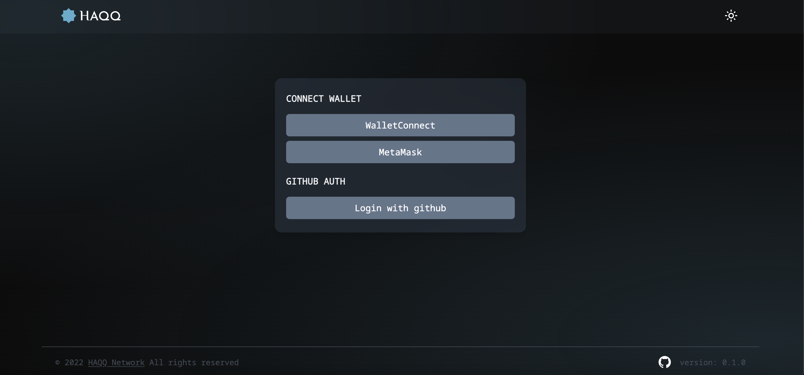
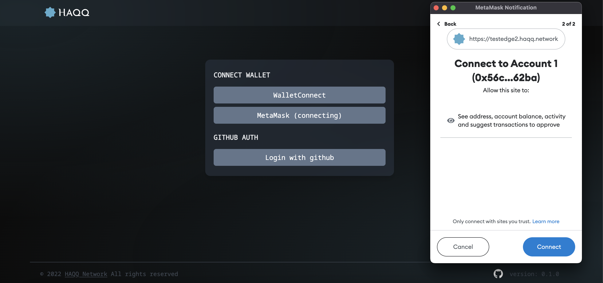
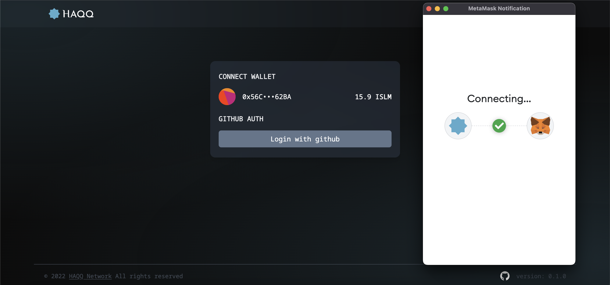
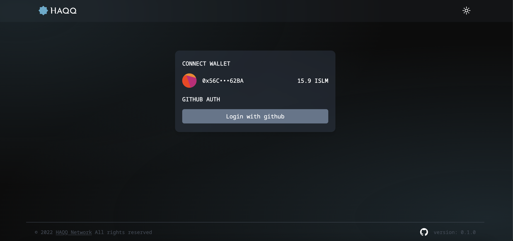
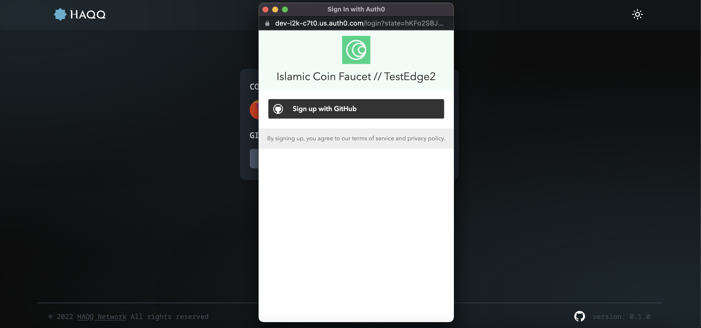
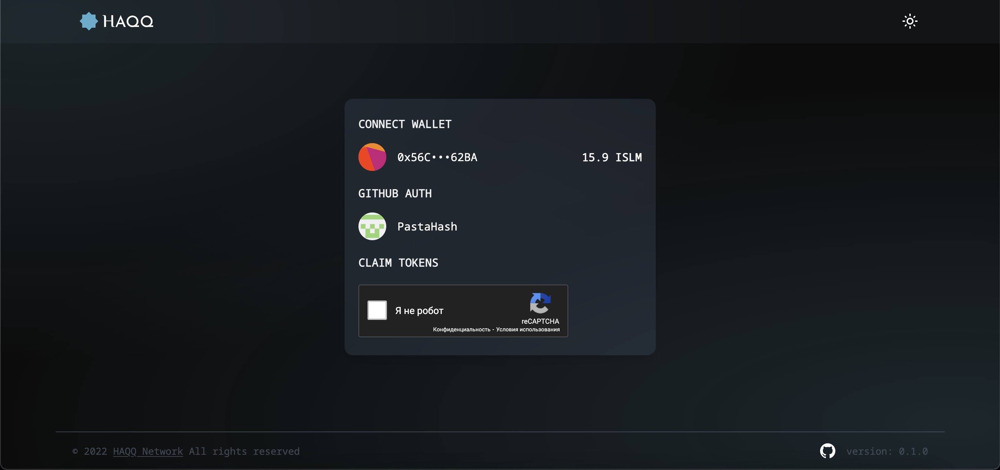
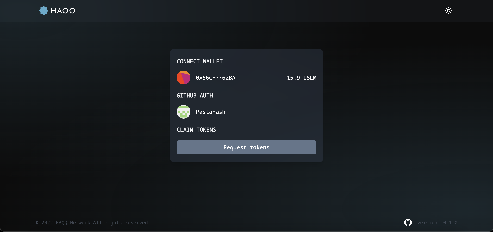
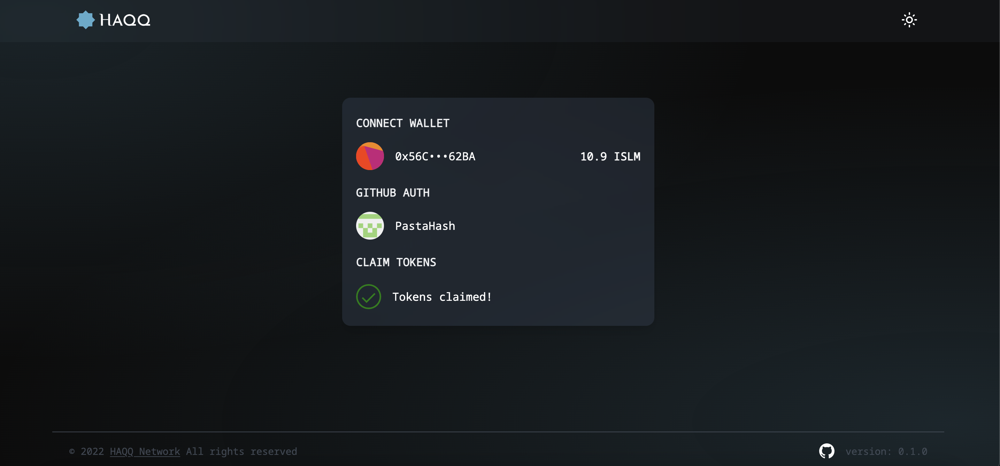

<!--
order: 2
-->

# Faucet-TestEdge

Check how to obtain testnet tokens from the Haqq faucet website {synopsis}

The Haqq TestEdge Faucet distributes small amounts of ISLM to anyone who can provide a valid testnet address for free.

::: tip
Follow the [Metamask](./../../docs/guides/keys-wallets/metamask.md) guide for more info on how to setup your wallet account.
:::

## Request Testnet tokens

<!-- markdown-link-check-disable-next-line -->
Once you are signed in to the MetaMask extension, visit the [Faucet](https://testedge2.haqq.network/) to request tokens for the testnet. Click the `Metamask` button, for example.

After that, you can see a topup window with your Metamask account. You can choose account for the connection with `Faucet`.Then click `Next` button and `Connect` but for establishing connection.

Please wait until connection will be establish.

After that click on `Login with github` button to authorizing via your GitHub account.

Click on `Sign up with Github` button to approve authorization.

Passing CAPTCHA.

Click on `Request Tokens` button to recive ISLM and wait until tokens Claim.

## Rate limits

To prevent the faucet account from draining the available funds, the Haqq TestEdge faucet imposes a maximum number of requests for a period of time. By default, the faucet service accepts 1 request per day per address. You can request ISLM from the faucet for each address only once every 24h. If you try to request multiple times within the 24h cooldown phase, no transaction will be initiated. Please try again in 24 hours.

## Amount

For each request, the faucet transfers some ISLM to the given address.
